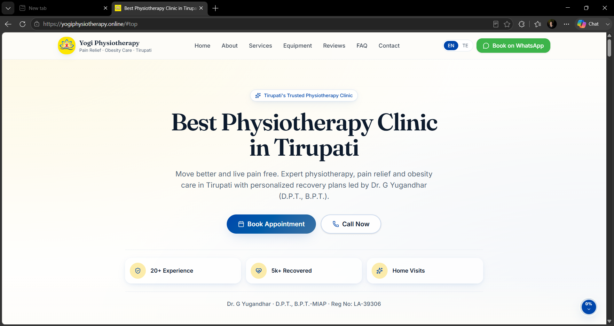
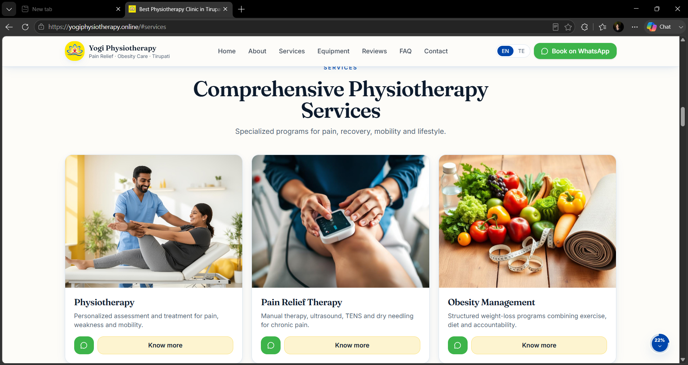
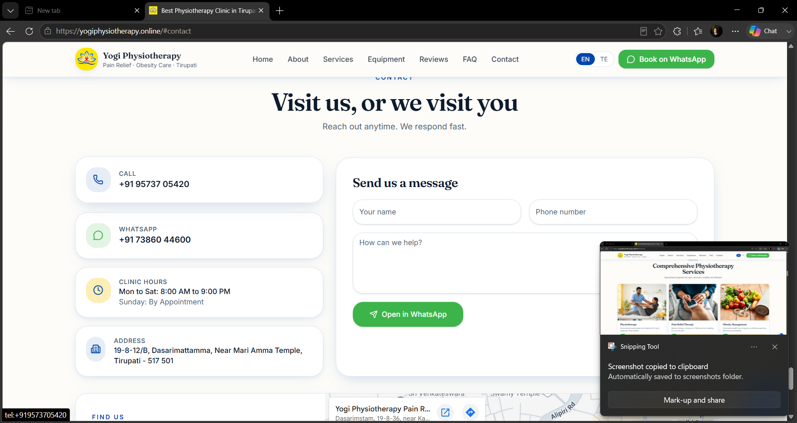

# 🏥 Yogi Physiotherapy Website

## NxtGenSec Internship Project

### 👩‍💻 Internship Details

- **Name:** Siva Tejaswini Maramreddy
- **Intern ID:** NGS-DEV26-MA07
- **Role:** Deployment Intern
- **Organization:** NxtGenSec
- **College:** Madanapalle Institute of Technology & Science (MITS)
- **Department:** Computer Science & Engineering

---

## 📌 Project Overview

Yogi Physiotherapy is a professional healthcare website developed during the NxtGenSec Internship Program. The website provides information about physiotherapy services, clinic details, patient support, and healthcare solutions through a modern and responsive user interface.

This project was developed using modern software development practices including GitHub collaboration, deployment workflows, testing, and production hosting.

---

## 🎯 Project Objectives

- Build a professional online presence for the clinic
- Provide service information for patients
- Improve accessibility and communication
- Ensure mobile-friendly user experience
- Deploy a production-ready website

---

## 🚀 My Contributions

As a Deployment Intern, I contributed to:

- Website deployment support
- GitHub repository management
- Testing deployed builds
- Deployment verification
- Quality assurance activities
- Team collaboration and project coordination
- Production release validation

---

## 🛠️ Technologies Used

- HTML5
- CSS3
- JavaScript
- Git
- GitHub
- Vercel
- Responsive Web Design

---

## ✨ Features

- Responsive Design
- Physiotherapy Service Information
- Contact Information
- Mobile-Friendly Interface
- Modern UI Design
- Fast Performance

---

## 🌐 Project Links

### Live Website
https://yogiphysiotherapy.online

### Original Repository
https://github.com/NxtGenSec/yogiphysiotherapy

---

## 📚 Skills Acquired

- Git & GitHub
- Version Control
- Deployment Workflows
- Website Hosting
- Testing & Validation
- Team Collaboration
- Software Development Lifecycle

---

## 🎓 Learning Outcomes

Through this internship, I gained practical experience in deployment processes, software development workflows, GitHub collaboration, testing methodologies, and professional project management practices.

Working on a real-world client project helped me understand industry standards and team-based software development environments.

---

## 🙏 Acknowledgement

I would like to thank NxtGenSec, mentors, and team members for providing the opportunity to work on a real-world healthcare project and gain valuable industry experience.

---
## 📸 Project Screenshots

### 🏠 Home Page
The landing page provides an overview of the clinic, services, and appointment options.

### 🩺 Services Page
Displays physiotherapy treatments and healthcare services offered by the clinic.

### 📞 Contact Page
Allows patients to connect with the clinic through contact information and enquiry options.

## ⚠️ Disclaimer

This repository is created for showcasing my internship experience and contributions.

The original project and source code belong to NxtGenSec and the respective contributors. Full credit goes to the original development team.

---

### Siva Tejaswini Maramreddy
### Deployment Intern | NxtGenSec
### B.Tech CSE | MITS
